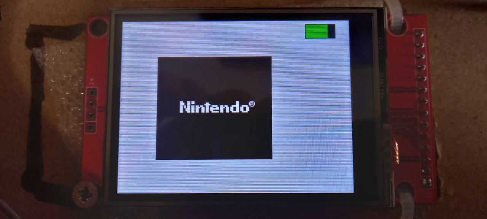
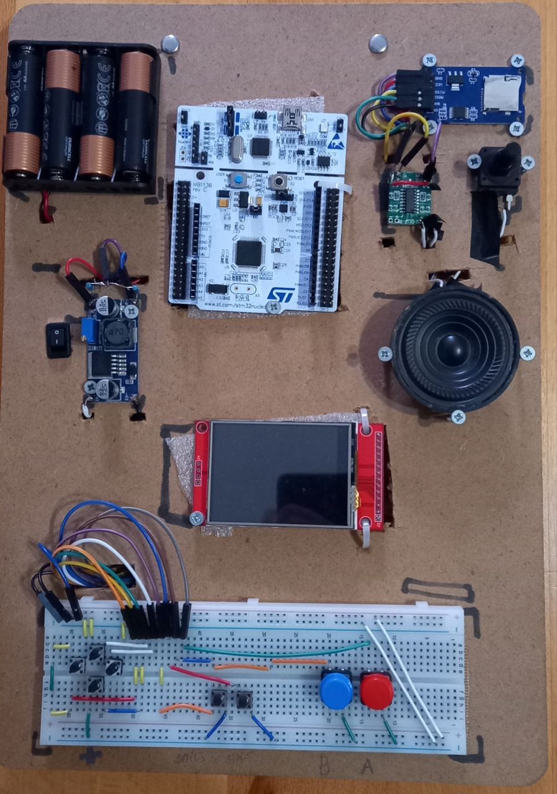
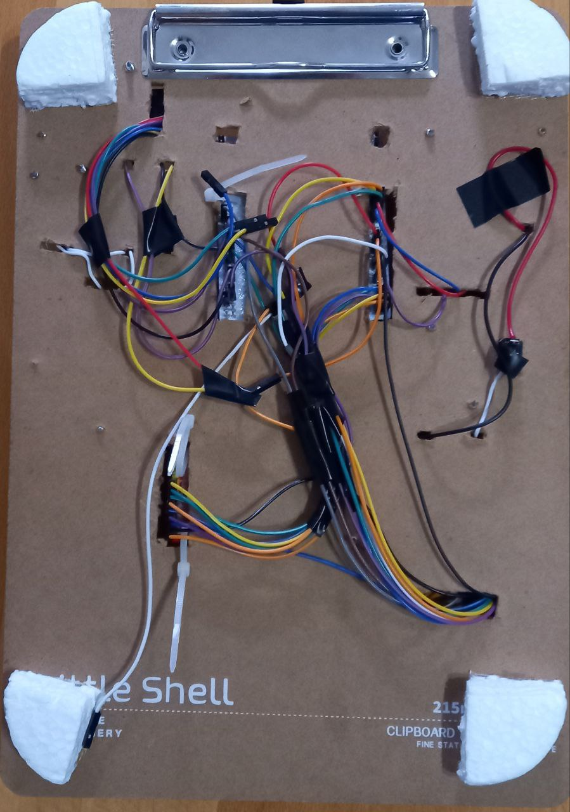
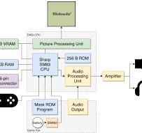

# Gameboy-STM32F411RE-Project

This project is an attempt to build a complete Nintendo Game Boy emulator running on the **STM32F411RE** microcontroller (ARM Cortex-M4).  
It is written in **C**, uses **PlatformIO** for building/flashing, and runs **bare-metal** (without HAL or CubeMX) using direct register access.

## 🎮 Demo Video
[https://github.com/EmreArapcicUevak/Gameboy-STM32F411RE-Project/issues/1](https://github.com/user-attachments/assets/04ac2201-e284-4587-832b-47be5e55016f)

---

## Project Status

Due to limited time to fully optimize our own emulator core for the STM32, we integrated the **Peanut-GB** emulator by **deltabeard**.

Peanut-GB repository: https://github.com/deltabeard/Peanut-GB/tree/master  
Our own custom emulator (PC version): https://github.com/VedadSiljic/Gameboy-Emulator  

Our original intention was to write the entire emulator ourselves and custom libraries utilizing SD Cards and TFT displays.

Achieving full-speed emulation on an 84 MHz microcontroller with limited RAM requires highly efficient optimization and cycle-accurate PPU/APU logic.  
To meet deadlines, **Peanut-GB** was used because it is lightweight and optimized for embedded devices.

We also weren't able to finish sound (APU) and reading ROMS from the SD card due to time constraints, but it is planned for future updates as 
can be seen in the library files that are already included, there are
already good portions of the codes written out.

---

## Features

### ✅ Currently Working
- Game ROM execution
- Boot ROM execution
- Button input support
- Display output
- Stable performance with simple games

### ❌ Not Implemented Yet
- Sound (APU)
- Save states
- SD card ROM selection
- Full custom emulator core (planned future replacement of Peanut-GB)

---

## Requirements

- STM32F411RE development board (or compatible)
- PlatformIO (VSCode or CLI)
- Game Boy **boot ROM** (dumped legally)
- Game Boy game ROM (.gb)
- Basic knowledge of embedded development and microcontrollers

---

## Hardware Setup (Template)

| STM32 Pin | Component                 | Description / Function                                               |
|-----------|---------------------------|-----------------------------------------------------------------------|
| **Power** |                           |                                                                       |
| 3.3V      | Display VCC, SD VCC, etc. | Main logic supply for display, SD card and MCU peripherals           |
| GND       | Display GND, SD GND, etc. | Common ground                                                        |
|           |                           |                                                                       |
| **Analog / Battery** |               |                                                                       |
| PA0       | Battery sense input       | ADC input for measuring battery voltage                              |
|           |                           |                                                                       |
| **Buttons / Gameplay Inputs** |      |                                                                       |
| PB3       | Button SELECT             | Digital input (button)                                               |
| PA5       | Button A                  | Digital input (button) *(conflicts with SD SPI1_SCK, see notes)*     |
| PA6       | Button B                  | Digital input (button) *(conflicts with SD SPI1_MISO, see notes)*    |
| PA7       | Button START              | Digital input (button) *(conflicts with SD SPI1_MOSI, see notes)*    |
| PC10      | Button LEFT               | Digital input                                                        |
| PC11      | Button DOWN               | Digital input                                                        |
| PC12      | Button UP                 | Digital input                                                        |
| PC13      | Button RIGHT              | Digital input                                                        |
|           |                           |                                                                       |
| **Display (SPI2 + control)** |       | (From the SPI2 / GPIOC init code)                                    |
| PC0       | Display RESET             | GPIO output, toggled low → high during init to reset LCD             |
| PC1       | Display control (CS/DC)*  | GPIO output (exact role depends on rest of your code)                |
| PC2       | Display MISO (SPI2_MISO)  | Alternate function AF5, SPI2 MISO                                    |
| PC3       | Display MOSI (SPI2_MOSI)  | Alternate function AF5, SPI2 MOSI                                    |
| PC7       | Display SCK  (SPI2_SCK)   | Alternate function AF5, SPI2 SCK                                     |
| PB0       | Display backlight         | TIM3_CH3 PWM output (AF2) for LCD backlight brightness               |
|           |                           |                                                                       |
| **SD Card (SPI1)** |                  | (From `SD_SPI_Init`)                                                 |
| PA5       | SD card SCK (SPI1_SCK)    | Alternate function AF5, SPI1 SCK  *(conflicts with Button A)*        |
| PA6       | SD card MISO (SPI1_MISO)  | Alternate function AF5, SPI1 MISO *(conflicts with Button B)*        |
| PA7       | SD card MOSI (SPI1_MOSI)  | Alternate function AF5, SPI1 MOSI *(conflicts with START button)*    |
| PC4       | SD card CS                | GPIO output, chip select for SD card                                 |

> **Note:** There is a conflict between the SD card and the buttons **A**, **B**, and **START** because the SD card is still a work in progress and wasn't fully integrated yet.

---

## Legal ROM Note (Important)

This project **does not provide any Game Boy ROMs or BIOS files**.  
To stay within legal and academic guidelines:

- You must **dump the Boot ROM from your own Game Boy** hardware.
- You must **dump your game cartridges yourself**.
- Do not download copyrighted ROMs from the internet.

This project is strictly for educational and personal research purposes.

---

## Architecture Overview (High-Level)

The emulator follows the internal structure of the original Game Boy system:

- **CPU Emulation (LR35902)**  
  Handles instruction decoding, registers, flags, timers, and interrupts.

- **Memory Map**  
  Includes ROM, VRAM, WRAM, OAM, High RAM, I/O registers, and cartridge mapping.

- **PPU (Pixel Processing Unit)**  
  Responsible for background, window, and sprite rendering.

- **Timers & Interrupts**  
  Synchronize CPU, PPU, and input events.

- **Input Handling**  
  Maps STM32 button GPIO states to Game Boy input register.

- **(Planned) APU (Audio Processing Unit)**  
  Would emulate the 4 Game Boy sound channels.

---

## Project Structure

| Folder/File | Description |
|-------------|--------------|
| platformio.ini | PlatformIO configuration |
| src/ | Source code |
| include/ | Header files |
| lib/Emulator/boot_rom/ | Boot ROM dump (dmg_boot_rom.h) |
| lib/Emulator/game/ | Game ROM dump (e.g., tetris_rom.h) |
| test/ | Optional tests |

---

## Setup and Usage

Before building, add the following files:

### Boot ROM
- Filename: dmg_boot_rom.h  
- Must contain an array named: dmg_boot_bin  
- Place in: lib/Emulator/boot_rom/

### Game ROM
- Filename example: tetris_rom.h  
- Must contain an array named: game_rom  
- Place in: lib/Emulator/game/

### Build and Flash

1. Build the project  
   pio run  

2. Flash to STM32 board  
   pio run --target upload  

---

## Limitations

- Experimental project – not all games run full speed
- Sound support not available yet
- Limited MCU RAM restricts advanced features
- Performance depends on display hardware and SPI speed

---

## Planned Improvements

- Full custom PPU (accurate Game Boy rendering)
- APU (sound) support
- Load ROMs from SD card
- DMA-based rendering and performance improvements
- Save states and multi-ROM selection
- Replace Peanut-GB once optimized custom emulator is ready

---

## Acknowledgements

- **Peanut-GB by deltabeard** — lightweight emulator suitable for microcontrollers  
  https://github.com/deltabeard/Peanut-GB/tree/master
- STM32 bare-metal development community resources and examples

---

Feel free to open issues or submit pull requests for improvements.
